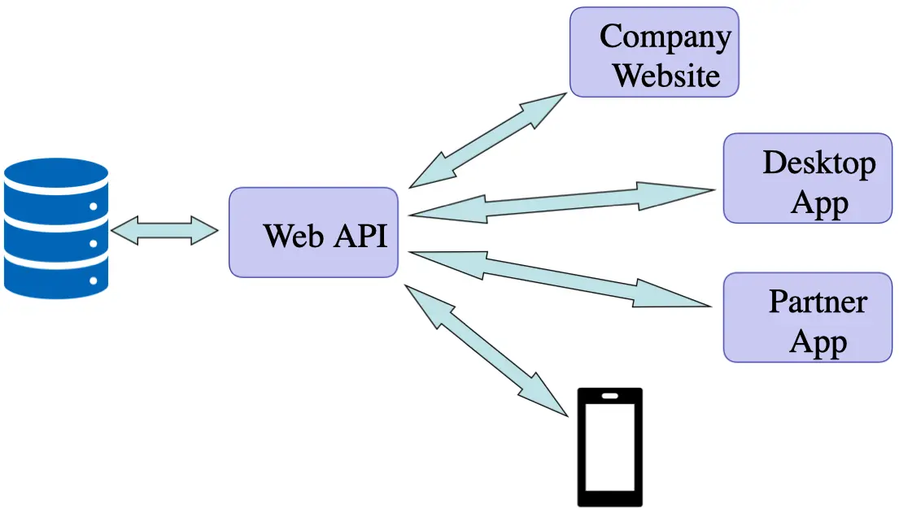

## Web API

- Used for building __HTTP__ Web Services
- Great for __RESTful__ services
- Methods return raw data which will automatically be converted into either __JSON__ or __XML__

## Web API Uses

## Web Services

- Web Services allow computer to computer **function calls** over the Internet
- Allow you to create/use best of breed or authoritative services from experts (credit card validators, weather reports, etc.)
- Two main approaches
- **REST** – Representational State Transfer
- **SOAP** – Simple Object Access Protocol
- _Cross-platform_ communication (OS, language)
- This was a big problem in the past
- Security administrators have had to close many ports
- Web services use __80 (http)__ and __443 (https)__
- Using __REST__, web services can pass complex objects back and forth

## Web API Controllers

- Controllers inherit from `Microsoft.AspNetCore.Mvc.ControllerBase`
- A base class for an MVC controller without view support
- Method names match HTTP verbs (__Get__, __Put__, __Post__, __Delete__)
- ASP.NET Routing maps URIs and HTTP Verbs to Controller actions (methods)
- This default routing can be overridden by annotating method names with attributes such as **[HttpGet]**, **[HttpPost]**, etc
- Method parameters are automatically bound to the request’s parameters by the _Model Binder_
- Actions must be `public`, can’t be `static`, no `ref` or `out` parameters

## Web API Routing

- Not specified in `Startup.cs`
- Specified in controller itself
- Uses `Route` attribute

## HTTP Verbs

| Verb   | Meaning                         |
|------| ------------------------------- |
| GET    | Retrieve existing data          |
| PUT    | Update or replace existing data |
| POST   | Add new data                    |
| DELETE | Remove data                     |

## Common HTTP Status Codes Groups

| Group | Meaning |
|:---:|---|
| **2xx** | (Successful) |
| **3xx** | (Redirected) |
| **4xx** | (Request error) |
| **5xx** | (Server error) |

## Common HTTP Status Codes

| Code | Reason | Meaning |
|:---:|---|---|
| **200** | _OK_ |  Success (Use for GET response)
| **201** | _Created_ | Used on POST request when creating a new resource
| **204** | _No Content_ | Used for DELETE or PUT response
| **400** | _Bad Request_ | Invalid Request
| **401** | _Unauthorized_ | Authentication
| **403** | _Forbidden_ | Authorization
| **404** | _Not Found_ | entity does not exist
| **406** | _Not Acceptable_ | bad params
| **409** | _Conflict_ | For POST / PUT requests if the resource already exists
| **500** | _Internal_ | Server Error
| **503** | _Service_ | Unavailable
||| See [HTTP Status Codes - Wikipedia](https://en.wikipedia.org/wiki/List_of_HTTP_status_codes) for more details |

## Model Binding

- Maps incoming data from the HTTP Body and/or query string (URI) to method parameters
- `MediaTypeFormatters` transform input and output data to/from .NET objects
- Transforms supplied data (even if it is JSON, XML or Form data) to the parameters

## Returning Results from Controller Actions

- Often the return type for _Web API Controllers_ is an `IActionResult` as it is for standard _MVC Controllers_
- The base controller class defines several useful methods for returning the most common status codes

## Return Status Codes

| MVC Method | Code | Meaning |
|---|:---:|---|
| **Ok()** |  __200__ | __GET__ response |
| **Created()** |  __201__ | __POST__ response |
| **CreatedAtRoute()** |  __201__ | __POST__ response, along with the new location and data for the object |
| **NoContent()** |  __204__ | __DELETE__ or __PUT__ response |
| **BadRequest()** |  __400__ | General nonspecific request error |
| **Unauthorized()** |  __401__ | User lacks permissions for request |
| **NotFound()** |  __404__ | __GET__ request with invalid __Id__ |

## Testing Web API Services

- For testing/sniffing Web API there are many options:
- [Fiddler](https://www.telerik.com/fiddler)
- [Advanced REST Client](https://install.advancedrestclient.com/install)
- [Swagger](https://swagger.io)
- Developer Tools in most browsers (F12) (monitoring only)
- Writing client test code in .NET or JavaScript

## Web API Documentation

- Your partners will need to know how to use your web service
- Help documentation can be generated using [Swagger](https://swagger.io), also known as [OpenAPI](https://www.openapis.org)
- __Swagger__ can also be used for testing
- __Swashbuckler__ is an ASP.NET Core implementation of __Swagger__

## Unit Testing Web API Controllers

- Very similar to unit testing of _MVC Controllers_:
- Create a Test Project
- Add `Microsoft.EntityFrameworkCore.InMemory` package
- Use the constructor to initialize the test database
- Write test methods to test the actions of the _Web API Controller_
