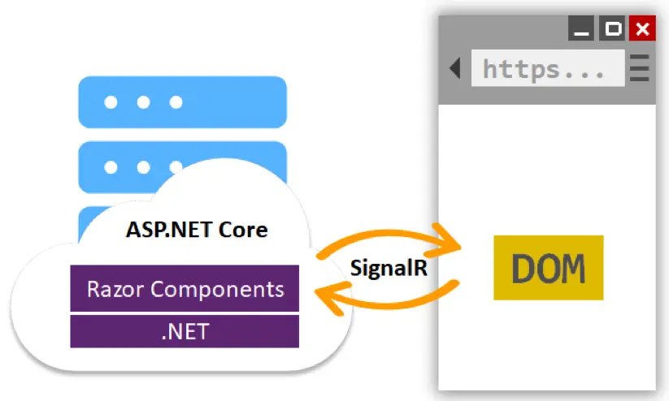
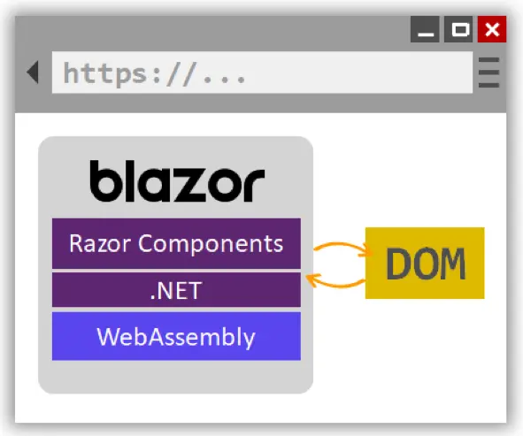

## What is Blazor

- Blazor is a __Single Page Application__ development framework
- The name Blazor is a combination/mutation of the words Browser and Razor (the
  .NET HTML view generating engine)
- Blazor allows us to write C# instead of JavaScript for client-side code
- First released in 2018
- The implication being that instead of having to execute Razor views on the
  server in order to present HTML to the browser, Blazor is capable of executing
  these views on the client
- Blazor does not require any kind of plugin installed on the client in order to
  execute inside a browser
- Blazor either runs server-side, in which case it executes on a server and the
  browser acts like a dumb terminal, or it runs in the browser itself by
  utilising __WebAssembly__
- Because __WebAssembly__ is a web standard, it is supported on all major browsers,
  which means also client-side Blazor apps will run inside a browser on
  Windows/Linux/Mac/Android and iOS

## WebAssembly

- __WebAssembly__ (abbreviated __Wasm__) is a binary instruction format for a
  stack-based virtual machine
- __Wasm__ is designed as a portable compilation target for programming languages,
  enabling deployment on the web for client and server applications
- [Languages that can target Wasm](https://github.com/appcypher/awesome-wasm-langs)

## Blazor Hosting Models

- Blazor Server
  - Blazor Server provides support for hosting Razor components on the server in
    an ASP.NET Core app
  - UI updates are handled over a __SignalR__ connection
    - __SignalR__ is a library that simplifies adding real-time web functionality to
      apps
    - Real-time web functionality enables server-side code to push content to
      clients instantly

## Blazor Server

- The runtime stays on the server and handles:
  - Executing the app's C# code
  - Sending UI events from the browser to the server
  - Applying UI updates to a rendered component that are sent back by the server

## Blazor Hosting Models

- Blazor WebAssembly
  - __WebAssembly__ code can access the full functionality of the browser via
    __JavaScript__, called __JavaScript__ interoperability, often shortened to
    __JavaScript__ interop or JS interop
  - .NET code executed via __WebAssembly__ in the browser runs in the browser's
    __JavaScript__ sandbox with the protections that the sandbox provides against
    malicious actions on the client machine
- When a Blazor __WebAssembly__ app is built and run in a browser
  - C# code files and Razor files are compiled into .NET assemblies
  - The assemblies and the .NET runtime are downloaded to the browser
  - Blazor __WebAssembly__ bootstraps the .NET runtime and configures the runtime to
    load the assemblies for the app
  - The Blazor __WebAssembly__ runtime uses __JavaScript__ interop to handle __DOM__
    manipulation and browser API calls

## Server vs. WebAssembly

| Feature                                        | Server | WebAssembly |
| ---------------------------------------------- | ------ | ----------- |
| Complete .NET Core API compatibility           | ✅     | ❌           |
| Direct access to server sources                | ✅     | ❌           |
| Small payload size with fast initial load time | ✅     | ❌           |
| App code secure and private on the server      | ✅     | ❌*          |
| Run apps offline once downloaded               | ❌     | ✅           |
| Static site hosting                            | ❌     | ✅           |
| Offloads processing to clients                 | ❌     | ✅           |

*Blazor __WebAssembly__ apps can use server-hosted APIs to access functionality that
must be kept __private__ and __secure__

## Blazor Server Project Structure

- `Program.cs` is unchanged
- `Startup.cs` is similar
- `Pages/_Host.cshtml`, `App.razor`, `Shared/MainLayout.razor`,
  `NavMenu.razor` all work together to setup the overall page structure
- The Razor components are in the `Pages` and `Shared` folders

## Razor Components

- Blazor apps are built using Razor components
- A component is a self-contained portion of user interface (UI) with processing
  logic to enable dynamic behavior
- Components can be nested, reused, shared among projects, and used in MVC and
  Razor Pages apps

## @inject

- The `@inject` directive enables the Razor Page to inject a service from the
  service container into a view
- The service container is established in the `ConfigureServices` method of
  `Startup.cs`
