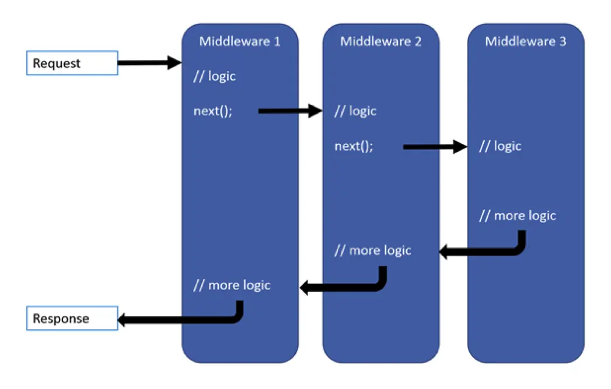

## ASP.NET Core Application Model

- An ASP.NET Core web application is actually an .NET console application
- The console application starts up an instance of an ASP.NET Core web server
- Microsoft provides a default, cross-platform web server named `Kestrel`
- The web application logic is run by `Kestrel`

## Console Application Entry Point

- The `Main` (case sensitive) method is the entry point of a C# application
- It must return either nothing (`void`) or an `int`
- It may optionally accept a `string` array of command line arguments

## Kestrel

- An ASP.NET Core app runs with an in-process HTTP server implementation
- The server implementation listens for HTTP requests and surfaces them to the
  app as a set of request features composed into an `HttpContext`
- Microsoft is working hard to make `Kestrel` fast
  - [TechEmpower Web Framework Benchmark](https://www.techempower.com/benchmarks/#section=data-r21&hw=ph&test=composite)
- Kestrel can be used by itself as an edge server processing requests directly
  from a network, including the Internet

- Kestrel can also be used with a reverse proxy server, such as Internet
  Information Services (IIS), Nginx, or Apache
- A reverse proxy server receives HTTP requests from the Internet and forwards
  them to `Kestrel`

## NuGet Package Manager

- Packages are compiled code that we add to our projects to increase
  functionality
- Many are written by Microsoft, many are written by 3rd parties
- You can see what packages are installed by right-clicking the project and
  selecting `Manage NuGet Packages`, you can also search for and install new
  packages from the browse tab

## Package Manager Console

- If the name of the package is known, it can also be installed from the `Package
  Manager Console` (__PMC__) using the `Install-Package` command
- The PMC is accessed from the `Tools / NuGet Package Manager` menu
- The PMC also has a variety of commands for working with the project, databases
  and more

## HttpContext

- Encapsulates all HTTP-specific information about an individual HTTP request such as:
  - Request, Response, Server, Session, Item, Cache, User's information like
    authentication and authorization and much more
- Every HTTP request creates a new object of `HttpContext` with current
  information

## ASP.NET Core Host

- ASP.NET Core apps configure and launch a host
- The host is responsible for app start up and lifetime management
- At a minimum, the host configures a server and a request processing pipeline
- The host can also set up logging, dependency injection, configuration and much
  more

## CreateDefaultBuilder

- The `CreateDefaultBuilder` method of the Host class is responsible for the
  following:
  - Configures `Kestrel` server as the web server
  - Sets the content root path
  - Loads host configuration
  - Configures logging
  - And more

## Startup.cs

- The `Startup` class typically has two methods `ConfigureServices` and
  `Configure`
- `ConfigureServices` is an optional method called before `Configure` and sets
  up classes for dependency injection such as a database context, identity and
  many more
- `Configure` specifies the middleware pipeline

## Middleware

- Middleware is code that gets called in between an initial request and the
  response to the client
- Each component:
  - Chooses whether to pass the request to the next component in the pipeline
  - Can perform work before and after the next component in the pipeline

## ASP.NET Core Middleware

- Middleware delegates are configured with `Run`, `Map` and `Use` methods
  - `Run` adds a terminal (or final) middleware delegate to the application's
    request pipeline
  - `Map` branches the request pipeline based on matches of the given request path
  - `Use` adds a middleware delegate defined in-line to the application's request
    pipeline
